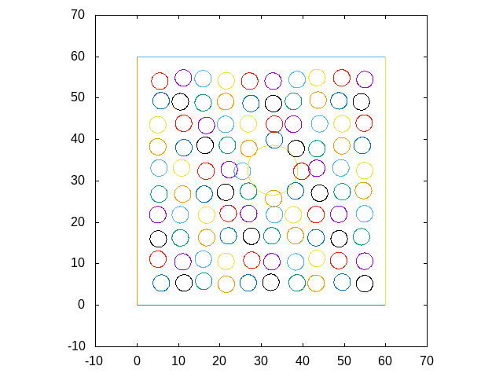

# Brownian motion

## Two dimensional gas

Finite elements simulation implemented in c++ for the brownian motion exhibit by a particle confined in a two dimensional gas.

To run the simulations plus a basic animation made in gnuplot run:

<code> ./2d-gas/gnu_plot_animation.py </code>

To run the simulations for analysis run:

<code> ./2d-gas/run_simulations.py </code>

flag = 'e': gets the whole ensemble information

flag = 'r': gets the random path

The analysis of the simulated data is performed in python using pandas and pystan. 

## Results

### 2d-Gas animation

### Random walk

*(Soon) Stochastic simulation performed in python to replicate the behavior of the system based in the analytical treatment of brownian motion.*
